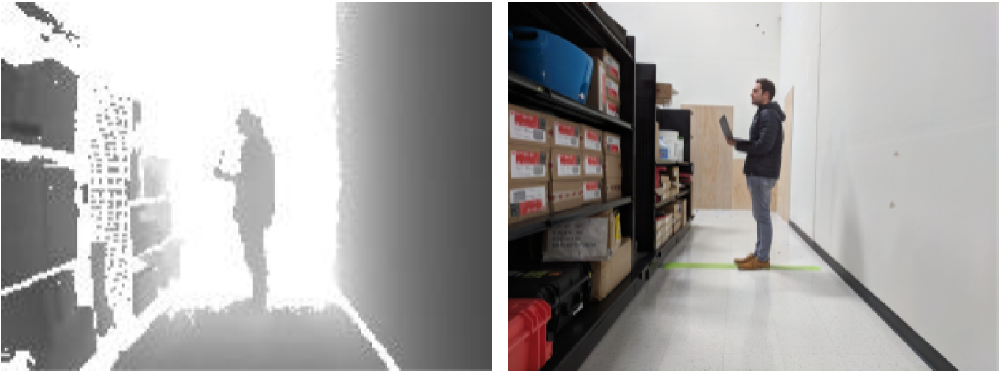
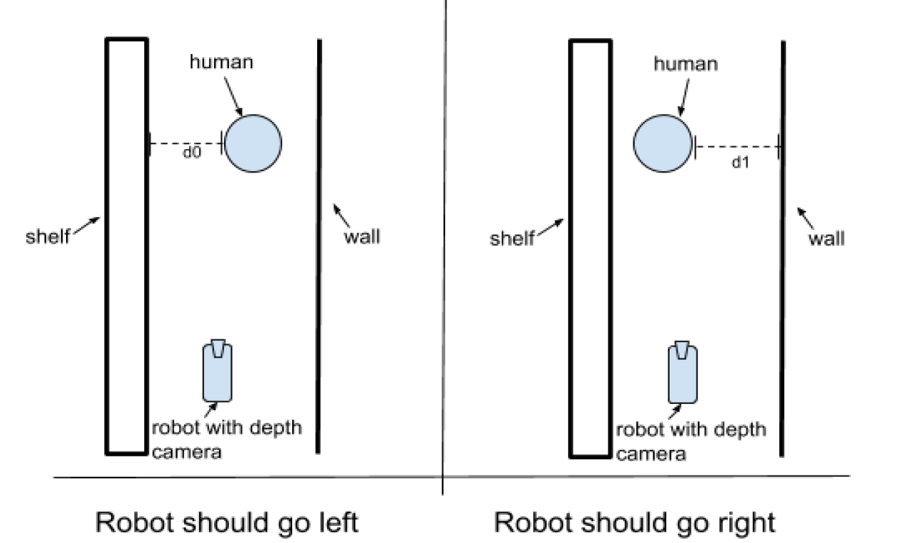

# Robotic_Depth_Perception_System

Robotic Depth Perception System for Human Avoidance

## Get Started

## Task Description

You’ve been tasked to implement a prototype of a component of a robotic depth
perception system for human avoidance. The task is to find a distance between a human and a
wall in a corridor using depth camera observations. Here is an example of a depth image (left)
received from a depth camera mounted on a robot. The darker the pixel the closer it is; black
corresponds to 0 meters and white corresponds to 5 meters. Just for reference, the
corresponding RGB image is shown on the right.



The purpose of the perception system is to ensure the robots avoids a human in a
corridor. Given an image from a depth camera, your perception system should output two
values:

1) Which side is safer to avoid a human ("left"or "right")?
2) What is the clearance for avoidance maneuver? Clearance is defined as the smallest
distance between a human and the obstacle closest to him (a wall or a shelf).

Here are examples of two different situations. Each picture is a "bird's eye"view on a
robot with a front facing depth camera and human in a corridor. In the situation depicted on the
left scheme, the perception system should output command "left "and a clearance "d0 "from the
human and the shelf, because it is safer for the robot to avoid a human on the left side, between
the human and the shelf. In the situation depicted on the right scheme, the perception system
should output command "right "and a clearance "d1 "` from the human and the wall, because it is
safer for the robot to avoid a human on the right side, between the human and the wall.



Depth camera outputs images of width=176, height=132 pixels, where each pixel value
represents the distance to the closest object to the camera (in meters). It has 70 degrees
horizontal field of view and 50 degrees vertical field of view. For simplicity, please assume that
there are no lense distortions (i.e. pinhole camera model with evenly spaced depth pixels
(horizontally and vertically)). Initially, the perception system is going to be used always in 1.5
meter wide corridors with similar shelves and walls and a single human in the corridor. A human
is always approximately 2m away from the depth camera. Robot is assumed to be always
approximately in the center of the corridor, oriented parallel to the walls.

**Submission form and evaluation criteria:**

You are provided with 3 typical images from the depth camera that have been attached
to this description. Every image is stored in a text file with space separated float distance values
in meters for each pixel:

```
3.276699829101562500e+01 … 3.276699829101562500e+01
… … ...
3.276699829101562500e+01 … 1.560999989509582520e+00
```

An image can be loaded with numpy function [np.loadtxt(filename)](https://docs.scipy.org/doc/numpy-1.13.0/reference/generated/numpy.loadtxt.html).

The customer has an automated script for testing your perception system. Please submit
an executable python3 script find_clearance.py that takes a single command line argument
which is a path to a depth image txt file. This script has to print left or right avoidance command
and a clearance between a human and an obstacles in meters for this maneuver. Here is what a
terminal command and output will look like:

```bash
> python find_clearance.py ~/human_corridor_0.txt
right 0.9
```

You may submit any other data or library code in the same folder with this script.
In order to save your time, you are allowed to use absolutely any(!) method for detecting
measuring clearance between a human and obstacles that you feel is suited to the problem.
You are allowed to use any web resources or other materials like publicly available code
samples. For example, you can use any state-of-the-art method that you are aware of. You may
use any python3 libraries provided they can be installed via pip package manager, additionally
you may use opencv . If you are missing some additional specifications, you may take any
reasonable assumptions about problem parameters.
Since it is a prototype, you are required to solve this task only(!) for 3 images provided to
you with this description. We are going to test your submission with images that are very close
to the ones we sent. However, please attach your notes regarding possible next steps for your
perception system. In particular, please note how would you generalize your algorithm for
different conditions and edge cases, assuming the task is always to avoid humans in corridors.